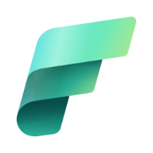

# Microsoft Fabric Workshops and Readiness

## Welcome to the Microsoft Fabric Workshops and Readiness! 

This repository is a guide for Microsoft Fabric Workshops and Readiness. 

## Summary of the resources and contents

### Getting Started with Microsoft Fabric

This unit introduces the basic concepts and components of Microsoft Fabric, such as capacity, workspace, and Fabric.

### Create a Microsoft Fabric Capacity

This unit teaches how to create a capacity using Microsoft Azure, which is a cloud computing platform that provides the infrastructure for Microsoft Fabric.

### Create a Microsoft Fabric Workspace

This unit shows how to create a workspace using Microsoft Fabric, which is a web-based interface that allows users to access and manage their data and applications on Microsoft Fabric.

### Choose your own Fabric Adventure

This is a selection of labs that explore the different capabilities and features of Microsoft Fabric, such as data ingestion, data transformation, data visualization, and data analysis.

To get started please, check out the repository [GitHub pages](https://microsoft.github.io/Fabric_Workshops/?WT.mc_id=academic-114547-leestott) website.

## Contributing

This project welcomes contributions and suggestions.  Most contributions require you to agree to a
Contributor License Agreement (CLA) declaring that you have the right to, and actually do, grant us
the rights to use your contribution. For details, visit https://cla.opensource.microsoft.com.

When you submit a pull request, a CLA bot will automatically determine whether you need to provide
a CLA and decorate the PR appropriately (e.g., status check, comment). Simply follow the instructions
provided by the bot. You will only need to do this once across all repos using our CLA.

This project has adopted the [Microsoft Open Source Code of Conduct](https://opensource.microsoft.com/codeofconduct/).
For more information see the [Code of Conduct FAQ](https://opensource.microsoft.com/codeofconduct/faq/) or
contact [opencode@microsoft.com](mailto:opencode@microsoft.com) with any additional questions or comments.

## Trademarks

This project may contain trademarks or logos for projects, products, or services. Authorized use of Microsoft 
trademarks or logos is subject to and must follow 
[Microsoft's Trademark & Brand Guidelines](https://www.microsoft.com/en-us/legal/intellectualproperty/trademarks/usage/general).
Use of Microsoft trademarks or logos in modified versions of this project must not cause confusion or imply Microsoft sponsorship.
Any use of third-party trademarks or logos are subject to those third-party's policies.
