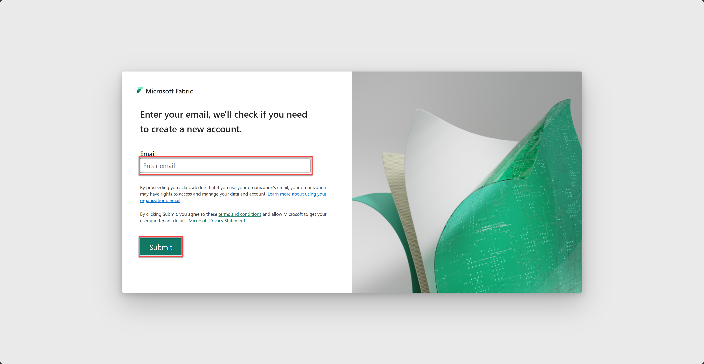
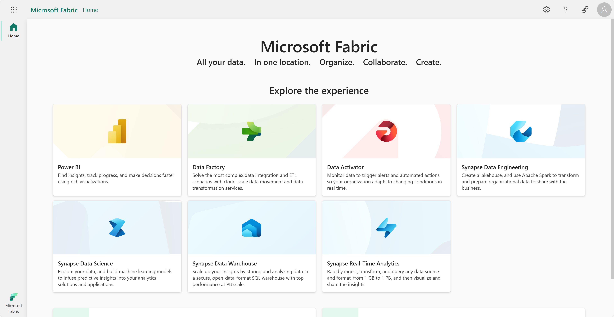
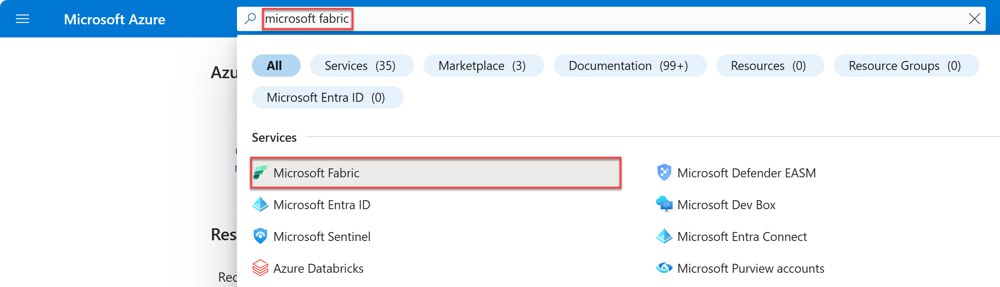
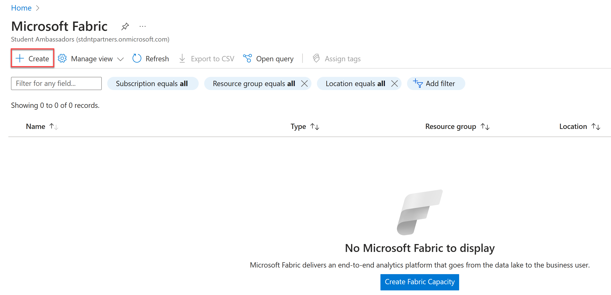
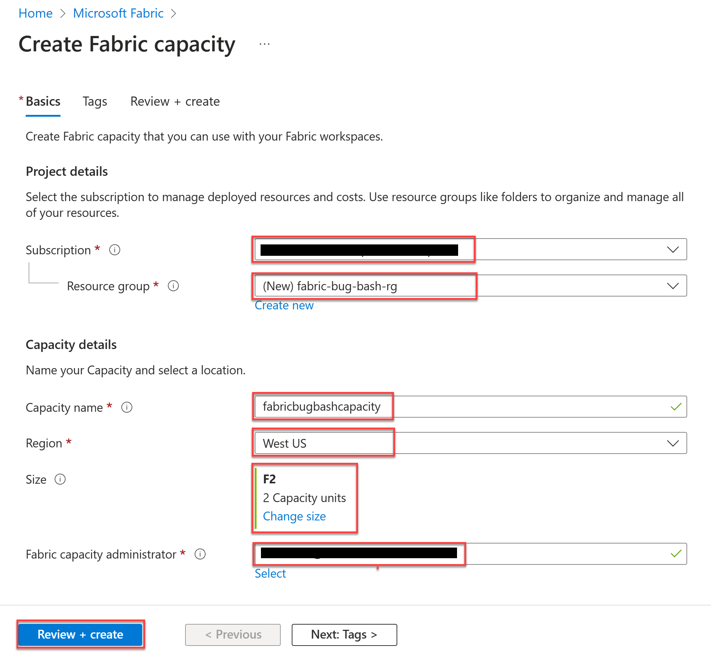

# Create a Microsoft Fabric Capacity from your Azure Subscription

In this exercise, you create a Microsoft Fabric Capacity from an existing Azure Subscription that enables you to use Microsoft Fabric capabilities. If you have access to a trial account and your tenant admin has granted users access to the Fabric Trial you will have access to a FT1 Fabric Trail Capacity which should be sufficient capacity for your 60 day trial period.

> [!NOTE]
> In order to complete this exercise and create capacity from an Azure Subscription, you need the following:
>
> - Access to Fabric on your tenant - [Enable Fabric](../00-getting-started/README.md?id=enable-microsoft-fabric-trial-on-your-existing-tenant&WT.mc_id=academic-114547-leestott). Note that you need a Microsoft work or school account to enable Fabric. If you don't have one, you can [sign up for a trial of Microsoft Office 365 E3 or higher](https://www.microsoft.com/microsoft-365/business/compare-more-office-365-for-business-plans/?WT.mc_id=academic-114547-leestott).
> - An Azure subscription (If you don't have access to [Fabric Trial Capacity](../00-getting-started/README.md?id=enable-microsoft-fabric-individual-user-trial&WT.mc_id=academic-114547-leestott)) - [Create one for free](https://azure.microsoft.com/free/ai-services/?WT.mc_id=academic-114547-leestott).
>

In this exercise, you will:

- Create a Microsoft Fabric free subscription.
- Provision a Microsoft Fabric capacity in the Azure portal.

## Create a Microsoft Fabric free subscription

For this exercise, you will use Microsoft Fabric to create an account.

1. Visit the [Microsoft Fabric](https://app.fabric.microsoft.com/singleSignOn/?WT.mc_id=academic-114547-leestott) sign in page, enter your email and select **Submit**.
    

2. Wait for validation then, you will be redirected to the **Microsoft Fabric** experiences page.
    

## Provision a resource in the Azure portal

For this exercise, you will use Azure Portal to provision a resource.

1. Visit the [Azure portal](https://portal.azure.com/?WT.mc_id=academic-114547-leestott) in your browser and sign in.

2. Type *microsoft fabric* in the search bar at the top of the portal page and select **Microsoft Fabric** from the options that appear.

    

3. Select **create** from the toolbar to initiate the capacity creation process.
    

4. Perform the following tasks:

    In the **Project details** section:
    | What | Comment|
    | ---- | ---- |
    | Subscription | Select your preferred subscription. |
    | Resource group | Select an existing resource group or create a new one using the **Create new** button.|

    In the **Capacity details** section:
    | What | Comment |
    |----|----|
    | Capacity name | Enter a unique name for your capacity. Only numbers and lower case letters are allowed. |
    | Region | Select the same region as your tenant location. Your tenant location is selected by default. |
    | Size | Select the **F2** capacity. Currently, the F2 capacity is the lowest available option that will allow you to experiment with fabric capabilities. |
    | Fabric capacity administrator | Enter the same email you used to create your Fabric subscription. |

    

5. Confirm your configuration settings and select **Create**. This action should start provisioning the resource.

    

6. Select **Go to resource**, to inspect your created resource. On this page, you are be able to manage your resource and locate important information.

> [!WARNING]
> Selecting the wrong size might consume hundreds of dollars in a couple of hours. Please be careful while performing these steps.
>
> **We encourage you to delete the capacity once you are done experimenting with it.**

Congratulations! You have successfully registered for a free Microsoft Fabric subscription and provisioned your own Fabric capacity.

*Head over to the next exercise to learn about [creating a fabric workspace](../02-create-fabric-workspace/README.md?WT.mc_id=academic-114547-leestott)!*
