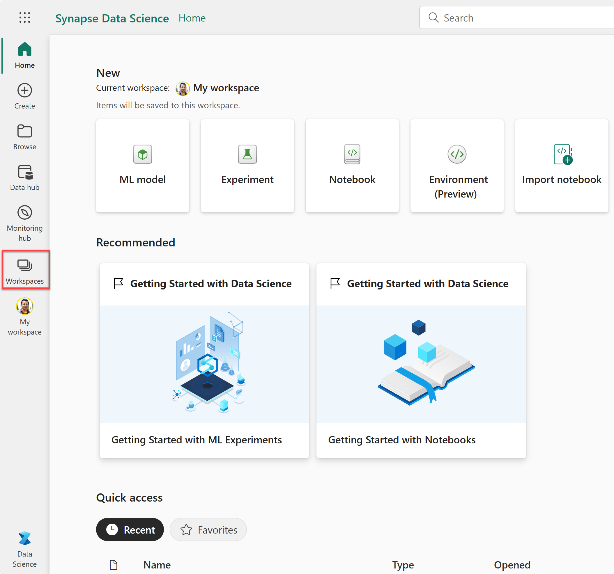
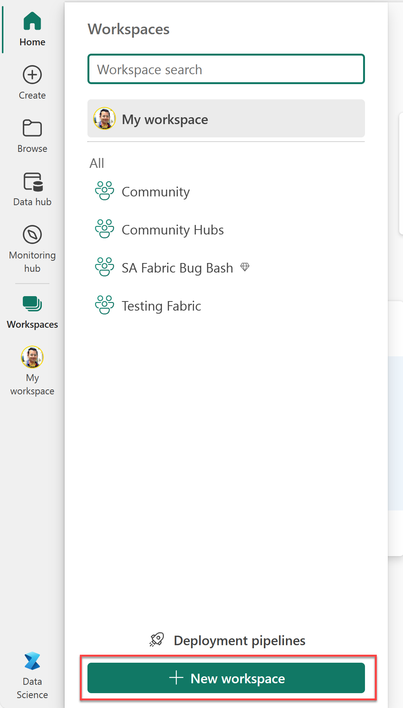
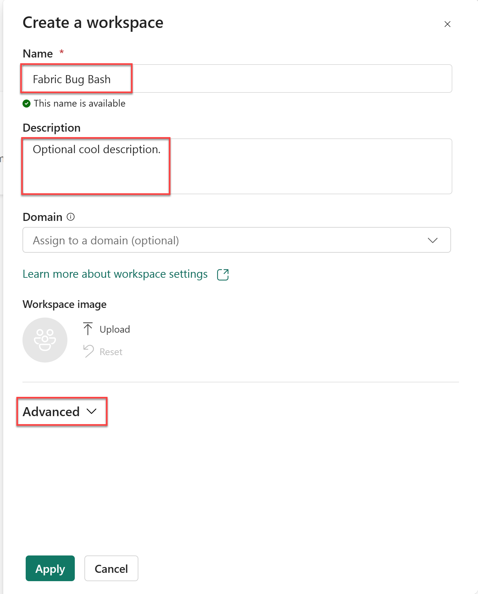
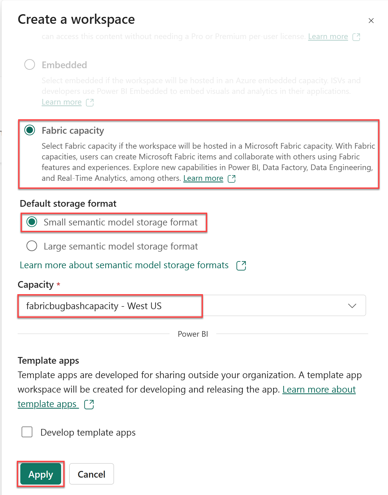
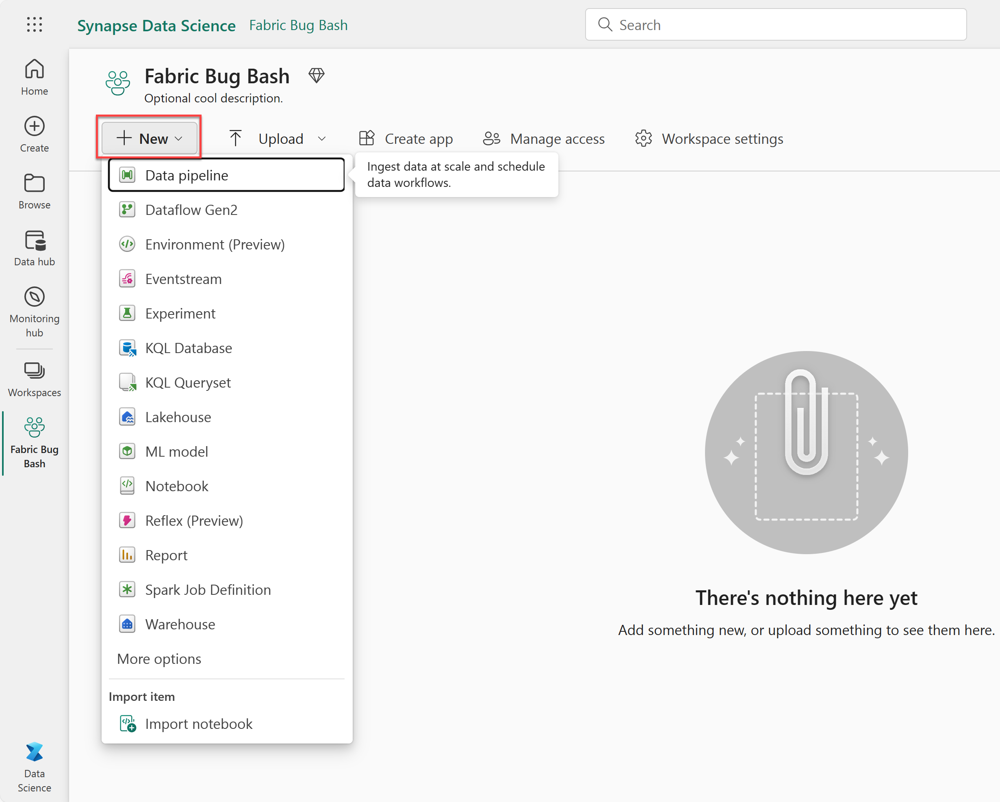

# Create a Microsoft Fabric Workspace

In this exercise, you create a Microsoft Fabric Workspace that stores your Microsoft Fabric workloads.

> [!NOTE]
> In order to complete this exercise, you need the following:
>
> - Access to Fabric on your tenant - [Enable Fabric](../00-getting-started/README.md?id=enable-microsoft-fabric-trial-on-your-existing-tenant&WT.mc_id=academic-114547-leestott). Note that you need a Microsoft work or school account to enable Fabric. If you don't have one, you can [sign up for a trial of Microsoft Office 365 E3 or higher](https://www.microsoft.com/microsoft-365/business/compare-more-office-365-for-business-plans/?WT.mc_id=academic-114547-leestott).
> - An Azure subscription - [Create one for free](https://azure.microsoft.com/free/ai-services/?WT.mc_id=academic-114547-leestott).
> - A Fabric subscription - [Create one for free](../01-create-fabric-capacity/README.md?id=create-a-microsoft-fabric-free-subscription&WT.mc_id=academic-114547-leestott).
> - A Fabric capacity - [Create one in the Azure portal](../01-create-fabric-capacity/README.md?id=provision-a-resource-in-the-azure-portal&WT.mc_id=academic-114547-leestott).

## Create a new workspace

For this exercise, you will use Microsoft Fabric to create a workspace.

1. Visit the [Microsoft Fabric studio](https://app.fabric.microsoft.com/?WT.mc_id=academic-114547-leestott) in your browser and sign in.
    

2. Select one of the available experiences for you. For example, select **Synapse Data Science**.

3. Select **Workspaces** from the left side navigation menu to create a new workspace.

    

4. Select **+ New workspace** to start the creation process.

    

5. Preform the following tasks:
    - Enter a unique name for your workspace.
    - Optionally, add a description.
    - Select **Advanced** to expand the hidden options.

    

6. Preform the following tasks:
    - Select **Fabric capacity** for the **License mode**.
    - Select the **Default storage format**. For example, **small semantic model storage format**.
    - Select your **Capacity** from the drop down menu.
    - Select **Apply** to confirm your selections and data entries.

    

7. Select **New** to create a fabric resources. For example, create a notebook.
    

Congratulations! You have successfully created a fabric workspace and added your capacity to it. Now, you can enjoy the cool Microsoft Fabric capabilities.

*Head over to the next page and [choose your own Fabric lab](../03-labs-and-modules/README.md?WT.mc_id=academic-114547-leestott)!*

*Or Go back to the [welcome page](../README.md?WT.mc_id=academic-114547-leestott)!*
